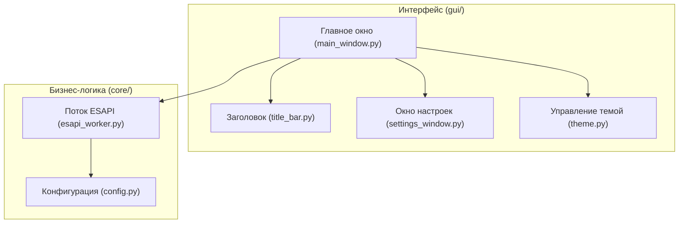

# План реализации: ESAPI D2cc Scraper с графическим интерфейсом на PyQt6

Этот документ описывает план перехода приложения ESAPI D2cc Scraper от консольной версии к современному графическому интерфейсу на PyQt6 с поддержкой темной темы, автозаполнения полей через ESAPI и гибких настроек.

## Архитектура проекта

Проект будет разбит на независимые модули для соблюдения чистоты кода и изоляции бизнес-логики (ESAPI) от интерфейса (PyQt6).

## Структура файлов

Новая структура проекта будет выглядеть следующим образом:
* `main.py` [MODIFY] — теперь будет точкой входа, запускающей PyQt6 приложение.
* `core/config.py` [NEW] — менеджер конфигурации (сохранение/загрузка `config.json` с путем к DLL ESAPI и другими настройками).
* `core/esapi_worker.py` [NEW] — модуль для работы с ESAPI через QThread (поиск пациентов, планов, структур и расчет D2cc в фоновом потоке, чтобы интерфейс не зависал).
* `gui/theme.py` [NEW] — стили оформления (темная тема, стилизация кнопок, текстовых полей, комбобоксов и скроллбаров).
* `gui/title_bar.py` [NEW] — кастомная верхняя панель (черный TitleBar с кнопками закрытия/сворачивания для бесшовного темного дизайна).
* `gui/settings_window.py` [NEW] — окно настроек (категории слева, параметры справа, сохранение пути к DLL).
* `gui/main_window.py` [NEW] — главное окно приложения со всеми полями ввода, автокомплитерами и таблицей результатов.

---

## Предлагаемые изменения по компонентам

### 1. Конфигурация и менеджер настроек (`core/config.py`)
- Загрузка и сохранение настроек в `config.json` (в корне проекта).
- Ключевые параметры: `eclipse_bin_path` (путь к DLL), `default_volume` (объем по умолчанию, например `2.0`), `last_patient_id`.
- Автоматическое создание файла при первом запуске с дефолтными путями.

### 2. Фоновые потоки ESAPI (`core/esapi_worker.py`)
Так как обращение к ESAPI из главного потока заморозит интерфейс Qt, все запросы будут выполняться в фоновых потоках `QThread`:
- **`PatientLookupWorker`**: Быстрый поиск совпадений по ID или Name через `GetPatientSummaries()`.
- **`PlanLookupWorker`**: Поиск планов пациента (исключая курсы с именем `"QA"`).
- **`CalculationWorker`**: Выполнение расчета D2cc для выбранных структур (Rectum, Bladder, Sigmoid, Bowel) на заданный объем.

### 3. Кастомный черный заголовок (`gui/title_bar.py`)
- Отключение стандартной рамки Windows (`Qt.WindowType.FramelessWindowHint`).
- Создание черной верхней плашки с кнопками Свернуть / Закрыть.
- Обработка перемещения окна мышкой за заголовок.

### 4. Дизайн и стилизация (`gui/theme.py`)
- Реализация единой палитры темной темы (темно-серый фон `#1e1e1e`, черный заголовок `#121212`, контрастные акценты для выделения полей).
- Визуальное выделение (красная/оранжевая подсветка) полей органов, если автосовпадение в плане не найдено.

### 5. Главное окно приложения (`gui/main_window.py`)
- **Поля ввода пациента**: `QLineEdit` с привязанным к ним `QCompleter`, который обновляется при вводе символов (с задержкой 300мс, чтобы не спамить запросами к ESAPI).
- **Поля органов**: Заменяются на редактируемые `QComboBox` с автозаполнением. При загрузке плана они наполняются списком всех структур плана.
- **Таблица результатов**: Вывод колонок: Структура, Доза (Gy) и Относительная доза (% от предписанной).

---

## План верификации

### Ручное тестирование на рабочей станции Eclipse:
1. Запуск приложения, переход в настройки, указание корректного пути к ESAPI DLL.
2. Проверка автозаполнения по ID пациента (должно подтягивать имя).
3. Проверка автозаполнения по имени пациента (должно подтягивать ID).
4. Проверка фильтрации планов (планы из курса QA не должны отображаться).
5. Проверка поиска органов:
   - Если орган найден (например, Rectum), поле должно иметь стандартный вид.
   - Если орган не найден (например, Sigmoid), рамка поля должна подсвечиваться красным/оранжевым.
   - Проверка выпадающего списка органов: клик по полю должен показывать все структуры плана.
6. Ввод различных объемов в поле (например, `2.0`, `1.5`, `5.0`) и нажатие кнопки "Calculate" — проверка корректности расчетов.
