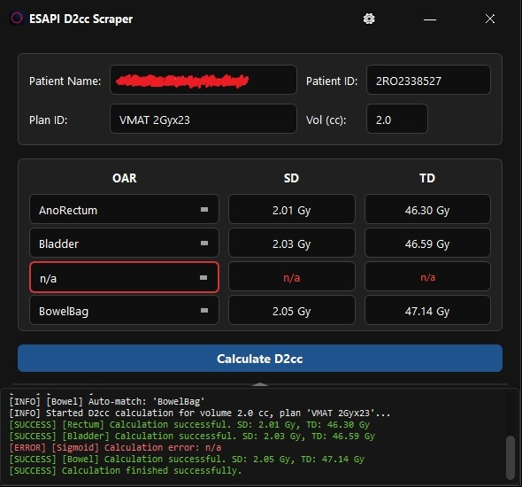

# ESAPI D2cc Scraper

[RU](#russian-version) | [EN](#english-version)

<details>
<summary><b>Show Screenshot</b></summary>



</details>

---

## Russian Version

**ESAPI D2cc Scraper** — это специализированное приложение с графическим интерфейсом на PyQt6 для автоматического извлечения дозовых параметров $D_{2\text{cc}}$ (доза на объем 2 кубических сантиметра) для критических органов (OAR: прямая кишка, мочевой пузырь, сигмовидная кишка, кишечник) из планов облучения Varian Eclipse через Eclipse Scripting API.

### Основные возможности
* **Автоматическое подключение к ESAPI**: Динамическое подключение к библиотекам Eclipse ESAPI.
* **Быстрый поиск пациентов**: Интерактивный поиск пациентов по ID или фамилии с автозаполнением.
* **Автоматическое сопоставление структур**: Умный поиск контуров органов в плане по набору синонимов.
* **Расчет параметров**: Быстрый расчет предписанной дозы на выбранный объем для выбранных OAR.

### Требования
* Windows 10 / 11
* Python 3.10+
* Установленный Varian Eclipse с настроенным доступом к ESAPI

### Запуск и Сборка
1. Установите зависимости:
   ```bash
   pip install -r requirements.txt
   ```
2. Запустите приложение:
   ```bash
   python main.py
   ```
3. Соберите исполняемый файл `.exe` с помощью готового скрипта:
   ```bash
   .\build_exe.bat
   ```
   Собранный файл будет доступен в папке `dist/ESAPI_D2cc_Scraper.exe`.

### Лицензия
Данный проект распространяется под лицензией [MIT](LICENSE).

---

## English Version

**ESAPI D2cc Scraper** is a specialized PyQt6 GUI application designed to automatically extract $D_{2\text{cc}}$ dose parameters (dose at 2 cc volume) for Organs at Risk (OARs: Rectum, Bladder, Sigmoid, Bowel) from Varian Eclipse treatment plans via the Eclipse Scripting API.

### Key Features
* **Automatic ESAPI Connection**: Dynamic loading and connection to Eclipse ESAPI libraries.
* **Fast Patient Search**: Interactive patient lookup by ID or Name with auto-completion.
* **Automatic Structure Matching**: Smart organ contour matching using synonyms.
* **Dose Calculation**: Quick calculation of prescribed dose at the selected volume for the selected OARs.

### System Requirements
* Windows 10 / 11
* Python 3.10+
* Installed Varian Eclipse environment with configured ESAPI access

### Installation & Build
1. Install dependencies:
   ```bash
   pip install -r requirements.txt
   ```
2. Run the application:
   ```bash
   python main.py
   ```
3. Compile the standalone `.exe` using the build script:
   ```bash
   .\build_exe.bat
   ```
   The compiled executable will be located at `dist/ESAPI_D2cc_Scraper.exe`.

### License
This project is licensed under the [MIT License](LICENSE).
